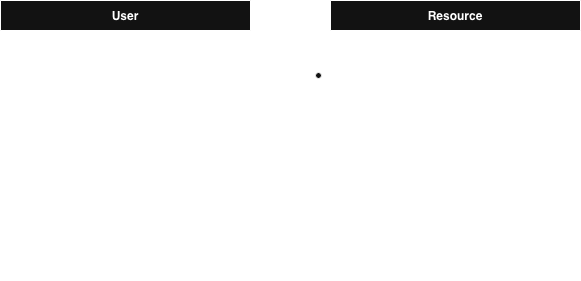

# Full Stack Resources

A lightweight, community-driven web platform where developers can share, discover and curate full-stack development resources.

🔗 **[View Live Site](https://full-stack-resources-ed27a57226de.herokuapp.com/)**

## Overview

Full Stack Resources is a platform designed to help developers share links with descriptions, browse a paginated list of resources, and manage their own submissions. The platform focuses on simplicity, moderation, and accessibility to quickly provide value to the developer community.

## Purpose

- **Central Hub**: Provide a central hub for full-stack developers to find and share valuable development resources
- **Knowledge Sharing**: Facilitate knowledge sharing in the developer community without overwhelming developers with unnecessary features
- **Foundation for Growth**: Establish a foundation for future enhancements such as voting, commenting, and categorization

## Target Audience

- **Full-stack software developers** seeking curated resources for learning or building projects
- **Beginner to intermediate developers** who want a trusted repository of links and tools
- **Tech enthusiasts** who enjoy contributing to developer knowledge-sharing communities

## Features

- Submit and share development resources with descriptions
- Browse paginated lists of community-submitted resources
- Manage your own resource submissions
- Clean, accessible interface focused on usability

## Entity Relationship Diagram

The application uses a simple relational database with two main entities:

- **User**: Handles authentication and user management
- **Resource**: Stores submitted resources with links and descriptions

## Project Management

Track project progress, user stories and development tasks on the [Project Board](https://github.com/users/niraj-sachania/projects/11/views/1).

## Contributing

Contributions are welcome! Please feel free to submit a Pull Request.

## License

This project is licensed under the MIT License - see the [LICENSE](LICENSE) file for details.
