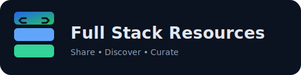
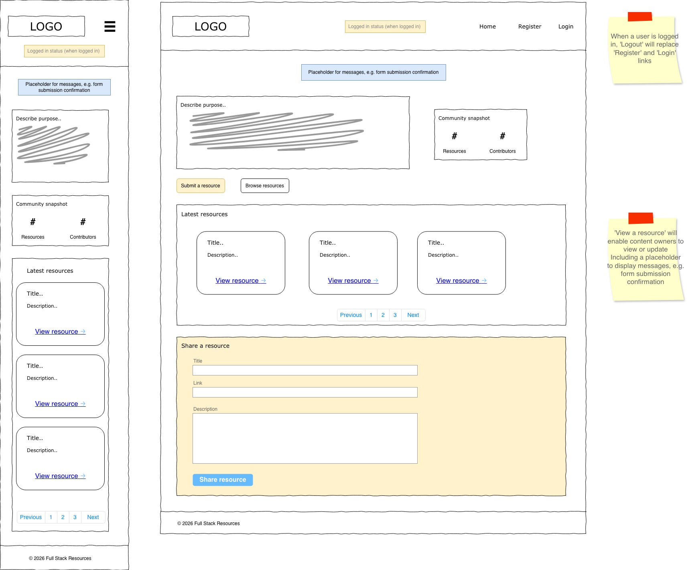
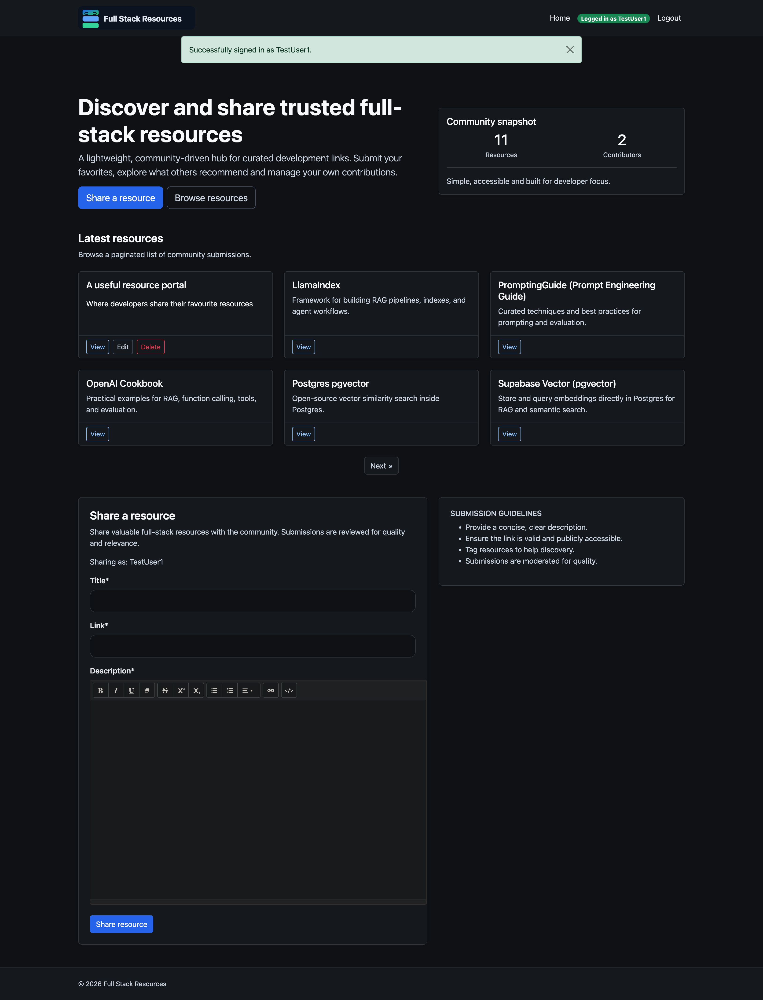
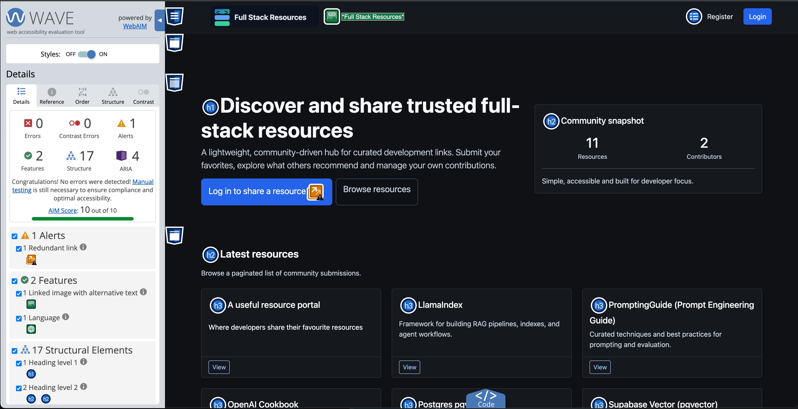
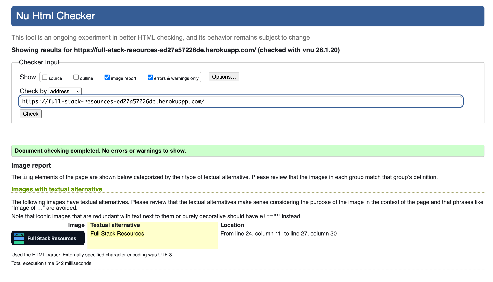
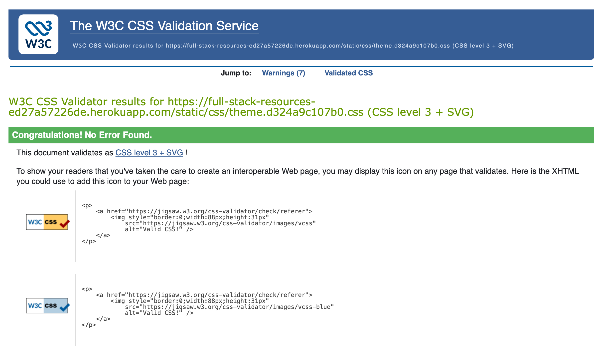
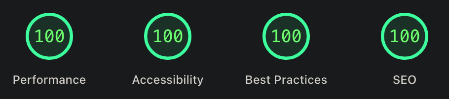
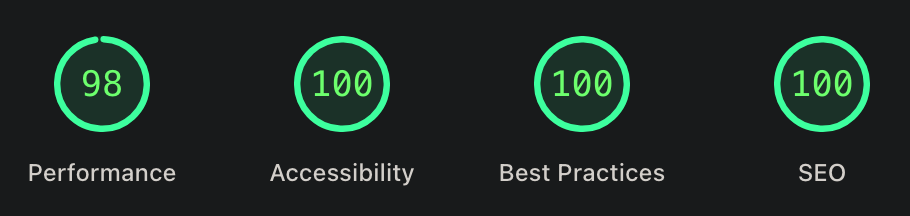
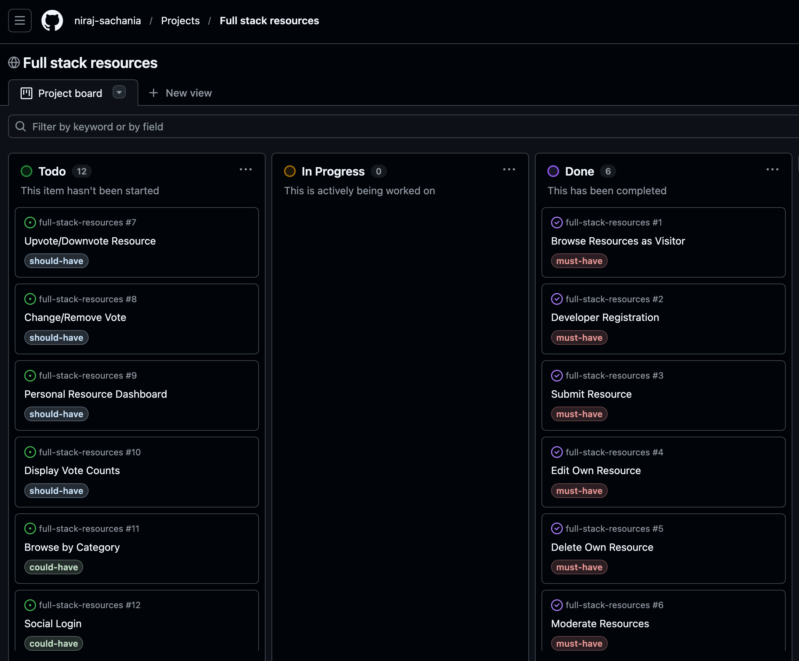

A lightweight, community-driven web platform where developers can share, discover and curate full-stack development resources.

🔗 **[View Live Site](https://full-stack-resources-ed27a57226de.herokuapp.com/)**

## Overview

Full Stack Resources is a platform designed to help developers share links with descriptions, browse a paginated list of resources, and manage their own submissions. The platform focuses on simplicity, moderation, and accessibility to quickly provide value to the developer community.

## Purpose

- **Central Hub**: Provide a central hub for full-stack developers to find and share valuable development resources
- **Knowledge Sharing**: Facilitate knowledge sharing in the developer community without overwhelming developers with unnecessary features
- **Foundation for Growth**: Establish a foundation for future enhancements such as voting, commenting, and categorization

## UX Design Process

### Scope

The goal of this open source project is for developers to share resources and contribute to the project itself by extending the portal’s features. The MVP focuses on demonstrating CRUD functionality in a Django project.

### Target Audience

- **Full-stack software developers** seeking curated resources for learning or building projects
- **Beginner to intermediate developers** who want a trusted repository of links and tools
- **Tech enthusiasts** who enjoy contributing to developer knowledge-sharing communities

### Features

- Submit and share development resources with descriptions
- Browse paginated lists of community-submitted resources
- Manage your own resource submissions
- Clean, accessible interface focused on usability

## Entity Relationship Diagram

The application uses a simple relational database with two main entities:

- **User**: Handles authentication and user management
- **Resource**: Stores submitted resources with links and descriptions

### Wireframes

### MVP screenshots

## Testing checklist

- ✅ Runserver without terminal or browser console errors
- ✅ Resource creation form validation (prevents duplicates even with case changes; required fields enforced)
- ✅ Create, edit, delete resources (edit/delete restricted to contributor only)
- ✅ Create user account
- ❌ Password reset at /accounts/password/reset/ returns 500 (needs fix)
- ✅ Correct nav links, CTA and form visibility based on login status
- ✅ Login and logout
- ✅ Logged-in status indicator ("Logged in as")
- ✅ Responsive view (mobile, tablet, desktop)
- ✅ Notification messages for login, form submission success, and validation errors
- ✅ Only approved resources are shown on the frontend
- ✅ Navbar hamburger button has accessible labeling
- ✅ Headings uses correct heading hierarchy
- ✅ Home link hidden on homepage

## Accessibility

WCAG test: 10/10 AIM score.

## Validation

100% HTML and CSS best practice

## Performance (PageSpeed Insights)
Desktop:

Mobile:

## Fixes applied

As per fix commits, the following improvements were applied:

- Static files configured for production with WhiteNoise.
- Template and layout adjustments for authentication pages.
- Resource CRUD permissions enforced (contributors can edit/delete only their own submissions).
- Case-insensitive resource title validation to prevent duplicate submissions.
- Accessibility improvements (navbar toggler labeling, heading hierarchy).
- Navigation polish (hide Home link on homepage).

Password reset remains failing in production because the mail server is not configured yet. This is outside the current MVP scope and will be addressed when email credentials are available.

## Project Management

Track project progress, user stories and development tasks on the [Project Board](https://github.com/users/niraj-sachania/projects/11/views/1).

## Deployment process

### View the live site

1. Open the live site link: https://full-stack-resources-ed27a57226de.herokuapp.com/

### Run locally

1. Clone the repository.
2. Create and activate a virtual environment:
	- `python3 -m venv venv`
	- `source venv/bin/activate`
3. Install dependencies:
	- `pip install -r requirements.txt`
4. Create `env.py` with required environment variables (e.g., `SECRET_KEY`, `DATABASE_URL`).
5. Run migrations:
	- `python manage.py migrate`
6. Start the dev server:
	- `python manage.py runserver`
7. Visit `http://127.0.0.1:8000/`.

### Deploy to Heroku

1. Go to https://dashboard.heroku.com/apps.
2. Select New → Create new app.
3. Fill the app name, set location to Europe, and click Create app.
4. In the app dashboard, open the Deploy tab.
5. Set Deployment method to GitHub and connect the repository.
6. Click Deploy Branch (return to this page and click again for subsequent re-deploys).
7. Use Open app to view the live site and obtain the public link.
8. In Settings → Reveal Config Vars, set environment variables (`DATABASE_URL`, `SECRET_KEY`, and any email settings if required).
9. If `DISABLE_COLLECTSTATIC=1` was set, remove it once WhiteNoise is configured.

## Contributing

Contributions are welcome! Please feel free to submit a Pull Request.

## License

This project is licensed under the MIT License - see the [LICENSE](LICENSE) file for details.
