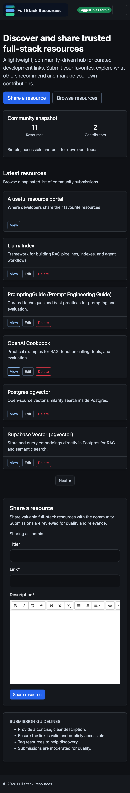
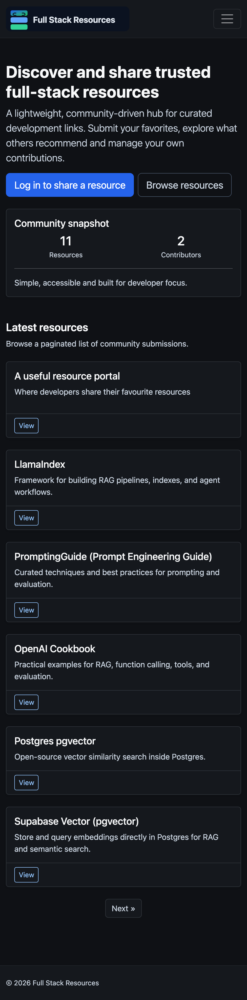

A lightweight, community-driven web platform where developers can share, discover and curate full-stack development resources.

🔗 **[View Live Site](https://full-stack-resources-ed27a57226de.herokuapp.com/)**

## Overview

Full Stack Resources is a platform designed to help developers share links with descriptions, browse a paginated list of resources, and manage their own submissions. The platform focuses on simplicity, moderation, and accessibility to quickly provide value to the developer community.

## Purpose

- **Central Hub**: Provide a central hub for full-stack developers to find and share valuable development resources
- **Knowledge Sharing**: Facilitate knowledge sharing in the developer community without overwhelming developers with unnecessary features
- **Foundation for Growth**: Establish a foundation for future enhancements such as voting, commenting, and categorization

## UX Design Process

### Scope

The goal of this open source project is for developers to share resources and contribute to the project itself by extending the portal’s features. The MVP focuses on demonstrating CRUD functionality in a Django project.

### Target Audience

- **Full-stack software developers** seeking curated resources for learning or building projects
- **Beginner to intermediate developers** who want a trusted repository of links and tools
- **Tech enthusiasts** who enjoy contributing to developer knowledge-sharing communities

### Features

- Submit and share development resources with descriptions
- Browse paginated lists of community-submitted resources
- Manage your own resource submissions
- Clean, accessible interface focused on usability

## User journeys

- Visitor lands on the homepage and browses the latest approved resources
- Visitor paginates through the list to explore more resources
- Visitor opens a resource link and is taken to the external site
- Visitor registers for an account
- Registered user logs in and sees logged‑in status
- Logged‑in user submits a new resource
- Logged‑in user edits their own resource
- Logged‑in user deletes their own resource (with confirmation)
- Logged‑in user logs out
- Admin logs into Django admin to approve, edit, delete resources, and manage users

## Tech Stack

- **Backend**: Django 4.2
- **Database**: PostgreSQL (via `dj-database-url`)
- **Frontend**: Django Templates, Bootstrap 5
- **Auth**: Django Allauth
- **Forms**: Django Crispy Forms + crispy-bootstrap5
- **Rich text**: Django Summernote
- **Static files**: WhiteNoise

## Entity Relationship Diagram

The application uses a simple relational database with two main entities:

- **User**: Handles authentication and user management
- **Resource**: Stores submitted resources with links and descriptions

### Wireframes

### MVP screenshots

Desktop logged-in view:

Desktop logged-out view:

Mobile views

Mobile logged-in view:

Mobile logged-out view:

## Differences between concept and deliverable

- Cards now act as complete content snippets, removing the dedicated resource detail page. Users link directly to the external resource from the card for a simpler journey.
- The Home link is conditional to avoid redundancy on the homepage, improving UX and addressing an accessibility scan flag.

## Testing checklist

- ✅ Runserver without terminal or browser console errors
- ✅ Resource creation form validation (prevents duplicates even with case changes; required fields enforced)
- ✅ Create, edit, delete resources (edit/delete restricted to contributor only)
- ✅ Create user account
- ❌ Password reset at /accounts/password/reset/ returns 500 (needs fix)
- ✅ Correct nav links, CTA and form visibility based on login status
- ✅ Login and logout
- ✅ Logged-in status indicator ("Logged in as")
- ✅ Responsive view (mobile, tablet, desktop)
- ✅ Notification messages for login, form submission success, and validation errors
- ✅ Only approved resources are shown on the frontend
- ✅ Navbar hamburger button has accessible labeling
- ✅ Headings uses correct heading hierarchy
- ✅ Home link hidden on homepage
- ✅ Pagination shows relevant buttons based on context (items count/availability)
- ✅ Deletion confirmation prompt
- ✅ PEP8 linting (flake8) passed for project code (excluding venv, migrations, cache)

## Manual Testing Demo

<video width="100%" controls>
    <source src="https://res.cloudinary.com/dhxzk8aco/video/upload/v1769178536/Capstonedemo_xytgob.mp4" type="video/mp4">
    Your browser does not support the video tag. <a href="https://res.cloudinary.com/dhxzk8aco/video/upload/v1769178536/Capstonedemo_xytgob.mp4">Watch the demo</a>.
</video>

## Automated unit tests

**Tech used:** Django TestCase, Django test client.

**How to run:**

- `python manage.py test`

**Outcome:**

- ✅ 8 tests passing (latest local run)

**Monitoring & actions:**

- Run tests before each commit and after changes to models, forms or views.
- Run again after dependency upgrades or config changes.
- If tests fail: review the failing test output, fix the underlying issue, rerun and update documentation if behavior changes.

## Accessibility

WCAG test: 10/10 AIM score.

## Validation

100% HTML and CSS best practice

## Performance (PageSpeed Insights)

Desktop:

Mobile:

## Fixes applied

As per fix commits, the following improvements were applied:

- Static files configured for production with WhiteNoise.
- Template and layout adjustments for authentication pages.
- Resource CRUD permissions enforced (contributors can edit/delete only their own submissions).
- Case-insensitive resource title validation to prevent duplicate submissions.
- Accessibility improvements (navbar toggler labeling, heading hierarchy).
- Navigation polish (hide Home link on homepage).

Password reset remains failing in production because the mail server is not configured yet. This is outside the current MVP scope and will be addressed when email credentials are available.

## Project Management

Track project progress, user stories and development tasks on the [Project Board](https://github.com/users/niraj-sachania/projects/11/views/1).

## Deployment process

### View the live site

1. Open the live site link: https://full-stack-resources-ed27a57226de.herokuapp.com/

### Run locally

1. Clone the repository.
2. Create and activate a virtual environment:
   - `python3 -m venv venv`
   - `source venv/bin/activate`
3. Install dependencies:
   - `pip install -r requirements.txt`
4. Create `env.py` with required environment variables (e.g., `SECRET_KEY`, `DATABASE_URL`).
5. Run migrations:
   - `python manage.py migrate`
6. Start the dev server:
   - `python manage.py runserver`
7. Visit `http://127.0.0.1:8000/`.

### Deploy to Heroku

1. Go to https://dashboard.heroku.com/apps.
2. Select New → Create new app.
3. Fill the app name, set location to Europe, and click Create app.
4. In the app dashboard, open the Deploy tab.
5. Set Deployment method to GitHub and connect the repository.
6. Click Deploy Branch (return to this page and click again for subsequent re-deploys).
7. Use Open app to view the live site and obtain the public link.
8. In Settings → Reveal Config Vars, set environment variables (`DATABASE_URL`, `SECRET_KEY`, and any email settings if required).
9. If `DISABLE_COLLECTSTATIC=1` was set, remove it once WhiteNoise is configured.

## Contributing

Contributions are welcome! Please feel free to submit a Pull Request.

## AI tools usage

Two development days were chosen to complete the MVP. With the focus on Django CRUD aspects, GPT-5.2-Codex and Claude Sonnet 4.5 were used via Copilot for crafting user stories and to assist with HTML/CSS coding for productivity, then customised to align with the wireframes. An incremental, iterative approach enabled testing, refining, and integrating code effectively, while maintaining full control over the project. AI was also used to help convert README content into Markdown.

Copilot proved effective for refreshing Django concepts (e.g. templating syntax) and assisting with configuration tasks such as WhiteNoise for static files on Heroku. It also helped identify and configure development tooling like djLint for formatting mixed HTML/Python templates.

GPT was used to generate the logged-in status indicator. The initial placement inside the navbar made it invisible on mobile unless the user opened the burger menu, which was caught during manual testing. This was corrected through further prompting by adding a mobile-visible instance in the header outside the nav.

GPT was used to run PEP8 linting with flake8. The initial scan surfaced an unused import and several line-length violations in settings and env configuration. These were corrected with GPT by suppressing the optional `env` import, wrapping long validator paths, and reformatting environment variable values. A follow-up scan confirmed a clean pass.

Copilot was also used to generate automated tests. While the initial test set covered CRUD processes, only about 50% of acceptance criteria were covered and the tests focused on backend DB interactions. Missing front‑end testing (pagination, registration flow, auto‑login redirect, invalid URL rejection, etc.) was then added through further prompting and refinement. So for effective testing, it's useful to provide the context of relevant acceptance criteria and validation to tie in with the purpose and any crucial business logic.

Overall, AI served as an intelligent co-pilot and accelerator — automating repetitive tasks and streamlining workflows — so focus could remain on higher-level architectural, creative and UX decisions.

## Credits

Aside from the AI assistance mentioned above, learnings from Code Institute’s AI‑augmented bootcamp were applied here, particularly the Django section. The concept and code for dismissible messages was borrowed from Code Institute, though the messages framework is an integral part of Django.

## License

This project is licensed under the MIT License - see the [LICENSE](LICENSE) file for details.
